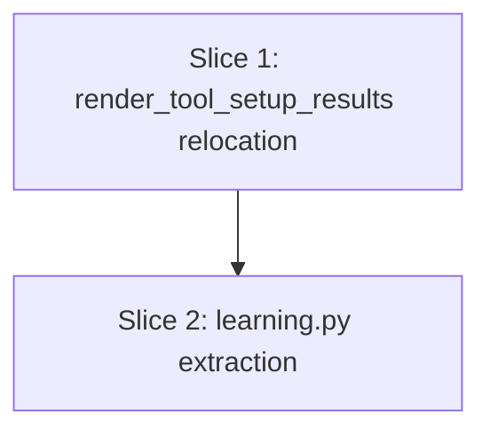

# Plan: Init Module Boundary Cleanup

**Created**: 2026-07-24
**Branch**: refactor/init-module-boundary-cleanup
**Status**: in-progress

## Goal

`review_planner/init.py` implements the harness-bootstrap lifecycle but has accreted two
unrelated responsibilities: a pure Markdown-formatting function (`render_tool_setup_results`)
that `render.py` has to reach into `init.py` for, and learned-practices persistence/merging
(`record_learned_practices`, `merge_learned_extensions`) that operates on the Catalog
vocabulary and is consumed by the `review` command flow. This plan relocates both to where
they conceptually belong — `render.py` and a new `review_planner/learning.py` — with zero
behavior change, so `init.py` is legible as "harness bootstrap only."

**Approach stance**: this is a pure structural relocation (migrate, not rewrite) — every
moved function keeps its exact signature and behavior. The one exception is a private-to-public
rename (`_platform_label` → `platform_label`), needed because `render.py` must call it after
the move; no other behavior changes, no new abstractions, no scope beyond what the spec names.
This plan removes two specific misplaced responsibilities from `init.py` — it does not claim
to make `init.py` fully "bootstrap-only" (the file retains its feedback-state/report/learning-queue
lifecycle, a separate concern out of scope here; a follow-up plan could address it later).

## Acceptance Criteria

- [ ] `review_planner/init.py` no longer defines `render_tool_setup_results`,
      `record_learned_practices`, `merge_learned_extensions`, `default_learned_practices_path`,
      `load_learned_practices`, `save_learned_practices`, or the `LEARNED_PRACTICES_FILE`
      constant — none of these names are importable from `code_review.review_planner.init`
      (except `record_learned_practices`, which `init.py` re-imports from `learning.py` for
      its own internal use — see below).
- [ ] `review_planner/render.py` defines `render_tool_setup_results` locally; its only new
      cross-module import is the renamed public `platform_label()` from `init.py`. Renaming
      `_platform_label` does not break `run_selected_tool_setup` (its internal call site at
      init.py:923 is updated to avoid the name collision — see Slice 1, Step 1.1).
- [ ] `review_planner/learning.py` exists and defines `record_learned_practices` and
      `merge_learned_extensions` (plus supporting load/save/path helpers and the
      `LEARNED_PRACTICES_FILE` constant), behavior unchanged. `learning.py` imports nothing
      from `init.py` or `render.py` (verified at the source level, not just behaviorally).
- [ ] `cli.py`'s import statement for `record_learned_practices`/`merge_learned_extensions`
      references `review_planner.learning` directly (verified at the source level — a
      behavioral/runtime test cannot distinguish a direct import from one re-exported
      through `init.py`, since function identity is import-path-agnostic).
- [ ] `init.py`'s only permitted import from the relocated modules is
      `record_learned_practices` from `learning.py` (used by
      `promote_accepted_feedback_to_learnings`); no import from `render.py`.
- [ ] Full test suite passes (`uv run pytest -q tests`) with zero behavior changes.
- [ ] `uvx ruff check` and `uv run pyrefly check` remain clean.

## Slices

### Slice 1: Relocate `render_tool_setup_results` into `render.py`

**Depends-on:** none
**Files:** `src/code_review/review_planner/init.py`, `src/code_review/review_planner/render.py`, `tests/test_render.py` (new), `tests/test_init.py`

**Behavior:**

```gherkin
Feature: Tool setup results rendering lives in the Render module

  Scenario: render_tool_setup_results is owned by the render module
    Given the code_review.review_planner.render module
    When render_tool_setup_results is imported from it
    Then its __module__ attribute is "code_review.review_planner.render"

  Scenario: rendering an empty result list
    Given no tool packs required setup
    When render_tool_setup_results is called with an empty list
    Then the output states "No selected tool packs required setup."

  Scenario: rendering populated setup results
    Given a list of tool setup results with steps
    When render_tool_setup_results is called with that list
    Then the output includes the platform label and one line per tool with its status
    And one indented line per step showing its kind prefix, text, and status

  Scenario: platform_label is a public, renamed capability of Init
    Given code_review.review_planner.init
    When run_selected_tool_setup resolves a platform-specific command
    Then it calls the public platform_label() function (not a private _platform_label)
    And run_selected_tool_setup completes without error for at least one OS branch
    (guards against the local-variable name collision at the function's original call site)

  Scenario: render_tool_setup_results is no longer importable from init
    Given the code_review.review_planner.init module
    When importing render_tool_setup_results from it
    Then an ImportError is raised
```

**Steps:**

#### Step 1.1: Move `render_tool_setup_results` to `render.py`; rename `_platform_label` to public `platform_label`

**Complexity**: standard

**RED**: Create `tests/test_render.py`. Add:
- `test_render_tool_setup_results_is_owned_by_render_module` — asserts
  `render_tool_setup_results.__module__ == "code_review.review_planner.render"`
  (fails today: the function is defined in `init.py` and only re-exported via
  `render.py`'s `from .init import render_tool_setup_results`).
- `test_render_tool_setup_results_empty` — empty list → `"No selected tool packs required setup.\n"`-style output (regression lock; passes today too, since currently importable from `render.py`).
- `test_render_tool_setup_results_with_steps` — populated results → platform line + per-tool/per-step lines (regression lock).
- `test_render_tool_setup_results_not_importable_from_init` — asserts
  `pytest.raises(ImportError)` around `from code_review.review_planner.init import render_tool_setup_results`
  (fails today: the import currently succeeds via `init.py`'s own definition).

Also add to `tests/test_init.py`:
- `test_run_selected_tool_setup_succeeds_after_platform_label_rename` (or extend an
  existing `run_selected_tool_setup` test) — calls `run_selected_tool_setup` with a
  minimal deterministic gate and asserts it returns normally (no `UnboundLocalError`).
  This is the regression test for the exact hazard below; it passes today (before the
  rename) and must still pass after GREEN.
- `test_platform_label_rename_is_total` — asserts
  `not hasattr(code_review.review_planner.init, "_platform_label")` after the rename, so
  the rename is proven total rather than `_platform_label` lingering as an alias
  (fails today: the private name still exists pre-rename).

**GREEN**:
- Move the `render_tool_setup_results` function body from `init.py` (currently ~line 1078)
  into `render.py`; delete it from `init.py`.
- Remove `render.py`'s `from .init import render_tool_setup_results`.
- Rename `init.py`'s `_platform_label` → `platform_label` (public); keep `_is_wsl` private
  (only used internally by `platform_label`).
- **Name-collision fix (required, not optional)**: `run_selected_tool_setup` (init.py:923)
  currently does `platform_label = _platform_label()`, then passes the local `platform_label`
  into `_command_for_platform(note, platform_label)` (init.py:936). After the rename, this
  local variable name would shadow the module-level `platform_label` function for the entire
  function body, and `platform_label = platform_label()` raises `UnboundLocalError` at
  runtime (Python treats any name assigned within a function as local to that whole function,
  including on the assignment's own RHS). Rename the local variable to something distinct,
  e.g. `platform = platform_label()`, and update its one downstream use at line 936 to
  `_command_for_platform(note, platform)`.
- `render.py` adds `from .init import platform_label` and calls it inside the moved
  `render_tool_setup_results`.
- Update `tests/test_init.py`'s two monkeypatch targets
  (`code_review.review_planner.init._platform_label` → `...init.platform_label`,
  at the tests for `run_selected_tool_setup`'s OS-specific branches).

**REFACTOR**: None needed — pure relocation plus the one required local-variable rename to
avoid the shadowing bug; no duplication introduced.

**Files**: `src/code_review/review_planner/init.py`, `src/code_review/review_planner/render.py`, `tests/test_render.py`, `tests/test_init.py`

**Commit**: `refactor: move render_tool_setup_results to render.py, publicize platform_label`

### Slice 2: Extract learned-practices persistence into `review_planner/learning.py`

**Depends-on:** 1
**Files:** `src/code_review/review_planner/learning.py` (new), `src/code_review/review_planner/init.py`, `src/code_review/cli.py`, `tests/test_learning.py` (new), `tests/test_init.py`

*Note: sequenced after Slice 1 because both slices touch `init.py`; running them in the same wave would collide.*

**Behavior:**

```gherkin
Feature: Learned-practices persistence lives in its own module

  Scenario: record_learned_practices is owned by the learning module
    Given the code_review.review_planner.learning module
    When record_learned_practices is imported from it
    Then its __module__ attribute is "code_review.review_planner.learning"

  Scenario: recording a new learned practice persists a repo-learnings pack
    Given a target repository with no prior learned practices
    When record_learned_practices is called with one practice string
    Then the learned-practices file contains a "repo-learnings" specialty pack
    And that pack's practices list contains the given string

  Scenario: merge_learned_extensions is owned by the learning module
    Given the code_review.review_planner.learning module
    When merge_learned_extensions is imported from it
    Then its __module__ attribute is "code_review.review_planner.learning"

  Scenario: merging learned extensions into config
    Given a target repository with a previously recorded learned practice
    When merge_learned_extensions is called with an empty config
    Then the returned config's extensions.specialties includes the repo-learnings pack

  Scenario: Init's feedback-promotion flow still writes learned practices
    Given accepted feedback items in the feedback state
    When promote_accepted_feedback_to_learnings is called
    Then the promoted items' actions are recorded as learned practices
    And the learned-practices file (owned by the learning module) reflects them

  Scenario Outline: relocated learned-practices names are no longer importable from init
    Given the code_review.review_planner.init module
    When importing <name> from it
    Then an ImportError is raised

    Examples:
      | name                          |
      | merge_learned_extensions      |
      | default_learned_practices_path |
      | load_learned_practices        |
      | save_learned_practices        |

  Scenario: the module boundary is enforced at the source level, not just behaviorally
    Given the source of review_planner/learning.py and review_planner/init.py
    When their import statements are inspected
    Then learning.py contains no import from review_planner.init or review_planner.render
    And init.py contains no import from review_planner.render
    And init.py's only import from review_planner.learning is record_learned_practices

  Scenario: cli.py imports learned-practices functions directly from learning, not via init
    Given the source of src/code_review/cli.py
    When its import statements are inspected
    Then merge_learned_extensions and record_learned_practices are imported from
      .review_planner.learning, not from .review_planner.init
```

**Steps:**

#### Step 2.1: Move learned-practices persistence to `review_planner/learning.py`

**Complexity**: standard

**RED**: Create `tests/test_learning.py` importing `record_learned_practices`,
`merge_learned_extensions`, `default_learned_practices_path` from
`code_review.review_planner.learning` (module does not exist yet — collection/import
error, i.e. RED). Add:
- `test_record_learned_practices_is_owned_by_learning_module` — asserts `__module__`.
- `test_merge_learned_extensions_is_owned_by_learning_module` — asserts `__module__`.
- `test_record_learned_practices_persists_repo_pack` (relocated from `test_init.py`).
- `test_merge_learned_extensions_adds_repo_specialty_pack` (relocated from `test_init.py`).
- `test_relocated_names_not_importable_from_init` (parametrized over
  `merge_learned_extensions`, `default_learned_practices_path`, `load_learned_practices`,
  `save_learned_practices`) — asserts `pytest.raises(ImportError)` for each when imported
  from `code_review.review_planner.init`. (`record_learned_practices` is deliberately
  excluded: `init.py` legitimately re-imports it for its own internal use, so it remains
  resolvable as `init.record_learned_practices` — that's the one permitted exception, not
  a leak.)
- `test_learning_module_has_no_cross_import` — parses (via `ast` or a simple substring/
  regex check on source text) the import statements in `review_planner/learning.py` and
  `review_planner/init.py`; asserts `learning.py` imports nothing from `.init` or `.render`,
  and `init.py` imports nothing from `.render`.
- `test_cli_imports_learned_practices_from_learning_module` — parses `src/code_review/cli.py`'s
  import statements (via `ast`) and asserts `merge_learned_extensions` and
  `record_learned_practices` are imported from `.review_planner.learning`, not
  `.review_planner.init`. This is necessary because a purely behavioral test (calling the
  functions, checking `__module__`) cannot distinguish "cli.py imports directly from
  learning.py" from "cli.py still imports from init.py, which merely re-exports from
  learning.py" — function identity is import-path-agnostic. Fails today (cli.py currently
  imports both from `.review_planner.init`).

**GREEN**:
- Create `review_planner/learning.py` with `LEARNED_PRACTICES_FILE` (the module-level
  constant, currently init.py:100), `default_learned_practices_path`,
  `load_learned_practices`, `save_learned_practices`, `record_learned_practices`,
  `merge_learned_extensions` moved verbatim from `init.py`.
- Delete these five definitions and the `LEARNED_PRACTICES_FILE` constant from `init.py`.
- `init.py` adds `from .learning import record_learned_practices` — its sole permitted
  import from `learning.py`, used only by `promote_accepted_feedback_to_learnings`.
- Update `cli.py`'s import of `merge_learned_extensions`/`record_learned_practices` to
  come from `review_planner.learning` instead of `review_planner.init`.
- Update `tests/test_init.py`: remove `default_learned_practices_path`,
  `merge_learned_extensions`, `record_learned_practices` from its
  `code_review.review_planner.init` import block; add
  `from code_review.review_planner.learning import default_learned_practices_path`
  (still needed by `test_promote_accepted_feedback_to_learnings_marks_items_done`, which
  stays in `test_init.py` since it tests Init's own feedback-promotion flow). Remove the
  two relocated tests (now living in `test_learning.py`).

**REFACTOR**: None needed — pure relocation.

**Files**: `src/code_review/review_planner/learning.py`, `src/code_review/review_planner/init.py`, `src/code_review/cli.py`, `tests/test_learning.py`, `tests/test_init.py`

**Commit**: `refactor: extract learned-practices persistence into review_planner/learning.py`

## Parallelization



| Wave | Slices (parallel) |
|------|-------------------|
| 1 | 1 |
| 2 | 2 |

## Complexity Classification

| Rating | Criteria | Review depth |
|--------|----------|--------------|
| `trivial` | Single-file rename, config change, typo fix, documentation-only | Skip inline review; covered by final `/code-review` |
| `standard` | New function, test, module, or behavioral change within existing patterns | Spec-compliance + relevant quality agents |
| `complex` | Architectural change, security-sensitive, cross-cutting concern, new abstraction | Full agent suite including opus-tier agents |

Both steps in this plan are classified `standard`: cross-file relocation with a public-API
rename (Slice 1) and a new module extraction (Slice 2), each within existing patterns and
with no new abstractions.

## Pre-PR Quality Gate

- [ ] All tests pass
- [ ] Type check passes (`uv run pyrefly check`)
- [ ] Linter passes (`uvx ruff check`, `uvx ruff format --check`)
- [ ] `/code-review` passes
- [ ] Documentation updated (if applicable — none expected; no README/CLAUDE.md content
      describes these internal module boundaries)

## Risks & Open Questions

- **Spec correction found during planning**: the original spec (`docs/specs/init-module-boundary-cleanup.md`)
  initially forbade any new `init.py → learning.py` or `render.py ← init.py` import, but
  two legitimate pre-existing dependencies were discovered during planning:
  (1) `init.py`'s `promote_accepted_feedback_to_learnings` calls `record_learned_practices`
  directly, and (2) the relocated `render_tool_setup_results` needs Init's private
  `_platform_label()` helper. The spec file has been amended in place to permit these two
  specific, one-directional imports (Init → Learning for #1, Render → Init for #2) while
  still forbidding the original problem direction (Render/CLI-review-flow reaching into
  Init for misplaced functionality). A one-line changelog note has been added to the top
  of the spec file recording this amendment for audit purposes. No further open questions.
- **Resolved during plan review**: renaming `_platform_label` to `platform_label` collides
  with an identically-named local variable at its sole internal call site
  (`run_selected_tool_setup`, init.py:923: `platform_label = _platform_label()`), which
  would raise `UnboundLocalError` at runtime if the local weren't also renamed — Python
  treats any name assigned within a function as local to the whole function, including on
  the assignment's own right-hand side. Both the Acceptance Test Critic and the Design
  Critic independently caught this during plan review. Fixed: Step 1.1's GREEN phase now
  explicitly renames the local to `platform`, and a regression test
  (`test_run_selected_tool_setup_succeeds_after_platform_label_rename`) locks in that
  `run_selected_tool_setup` still runs without error.
- **Risk**: renaming `_platform_label` to `platform_label` is a small scope expansion
  beyond pure relocation (a private-to-public rename). Mitigated by keeping `_is_wsl`
  private and changing no other behavior — only visibility, and the one call site is
  updated as described above.

## Build Progress

### Slices (grouped by wave)

#### Wave 1
- [x] Slice 1: Relocate `render_tool_setup_results` into `render.py`
  - [x] Step 1.1: Move `render_tool_setup_results` to `render.py`; rename `_platform_label` to public `platform_label`

#### Wave 2
- [x] Slice 2: Extract learned-practices persistence into `review_planner/learning.py`
  - [x] Step 2.1: Move learned-practices persistence to `review_planner/learning.py`

### Acceptance Criteria

- [x] `review_planner/init.py` no longer defines the relocated functions, helpers, or the
      `LEARNED_PRACTICES_FILE` constant (verified by source-level import-graph checks, not
      just behavioral tests).
- [x] `review_planner/render.py` defines `render_tool_setup_results` locally; `run_selected_tool_setup`
      still succeeds after the `platform_label` rename (no `UnboundLocalError`).
- [x] `review_planner/learning.py` exists with learned-practices persistence, behavior unchanged.
- [x] `cli.py`'s import statement for the learned-practices functions references
      `review_planner.learning` directly (source-level check).
- [x] `init.py`'s only permitted cross-module import is `record_learned_practices` from `learning.py`.
- [x] Full test suite passes with zero behavior changes.
- [x] `uvx ruff check` and `uv run pyrefly check` remain clean.

## Plan Review Summary

All five plan-review personas approve (1 revision cycle for Acceptance and Design; UX, Strategic, and Parallelization approved on first pass).

| Reviewer | Verdict (final) | Notes |
|---|---|---|
| Acceptance Test Critic | approve | Round 1: 3 blockers (missing reverse-import test, unverifiable cli.py import source, missing end-to-end regression test tied to the rename bug). Round 2: all resolved; one residual warning (no direct assertion that `_platform_label` is fully removed vs. aliased) — addressed by adding `test_platform_label_rename_is_total`. |
| Design & Architecture Critic | approve | Round 1: 1 blocker (the `UnboundLocalError` rename collision at init.py:923/936 — independently confirmed the same bug the Acceptance Critic found), 2 warnings (`LEARNED_PRACTICES_FILE` constant omitted from move inventory; goal overclaimed "bootstrap-only" outcome). Round 2: all resolved. Positive observations: dependency direction is correctly one-way with no cycles, `learning.py` fits the existing `review_planner/` module-decomposition convention, and slice sequencing correctly avoids a same-file collision. |
| UX Critic | approve (no revision needed) | No user-facing surface (pure internal refactor) — scope exception applied per the reviewer's own template. |
| Strategic Critic | approve (no revision needed) | Small, well-scoped, root-cause fix traceable to a concrete prior domain-analysis finding; Slice 1 alone is independently shippable. Two warnings incorporated: added a changelog note to the spec documenting the in-planning amendment (audit trail), and softened the Goal/Approach-stance wording to avoid overclaiming "bootstrap-only" purity given the `platform_label` visibility change. |
| Parallelization Critic | approve (no revision needed) | Fully sequential plan (1 slice per wave) — trivially safe per the template's "nothing to validate" rule. `plan-waves.sh` reports zero collisions. |

**Key fix from review**: both the Acceptance and Design critics independently caught a genuine, verified bug — renaming `_platform_label` to `platform_label` would collide with the identically-named local variable at `run_selected_tool_setup`'s call site (init.py:923), causing an `UnboundLocalError` at runtime. This is now explicitly fixed in Step 1.1 (local renamed to `platform`) with a dedicated regression test.
